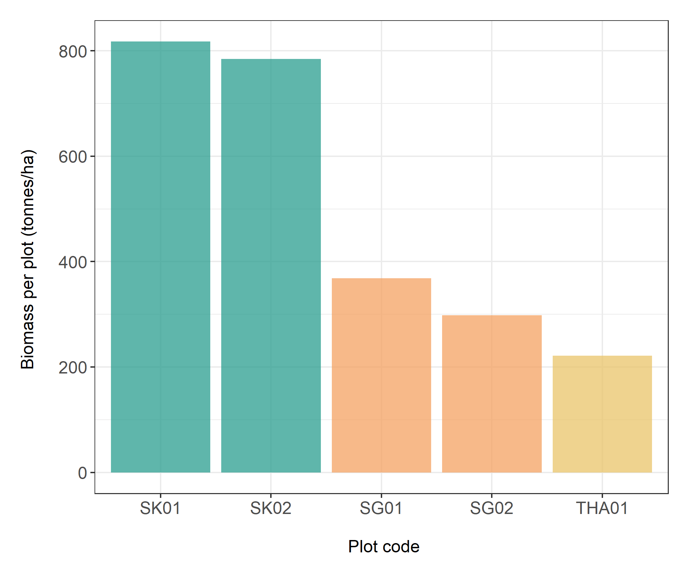
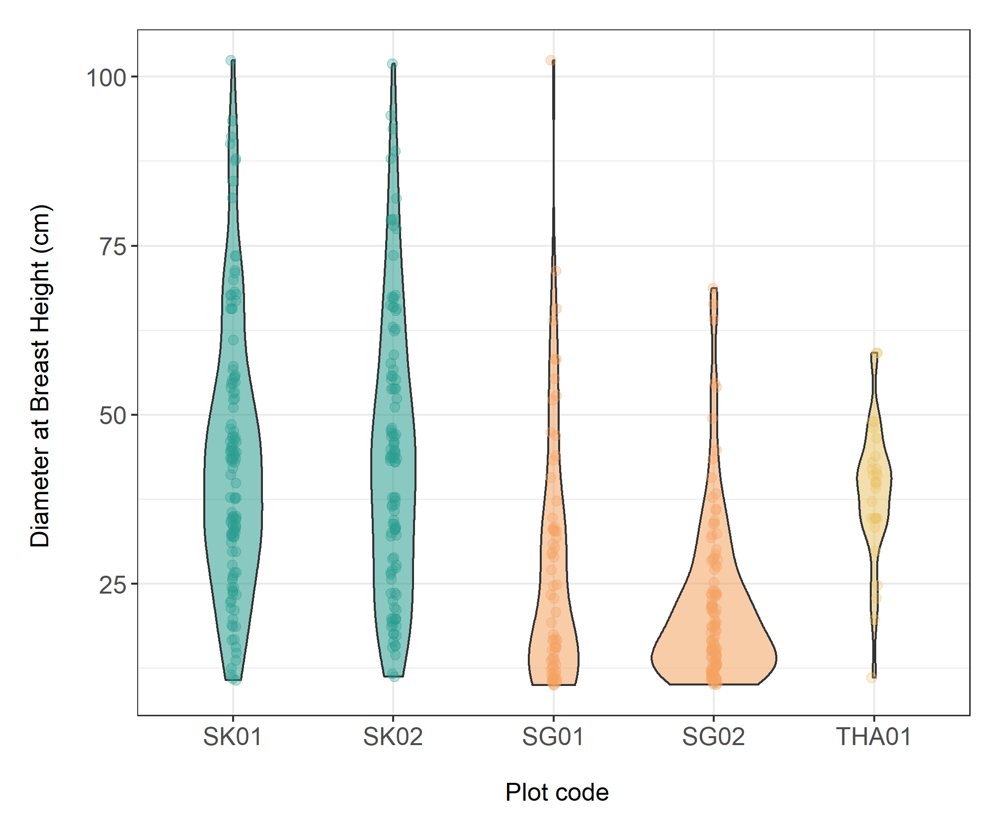

# EM-tree-data-plotting
Coded by Attapun Anivat (attapun-an) | 2020-11-13 | attapunanivat@gmail.com

Graphing the biomass of trees within each plot as a barplot (to show biomass per hectare) and violin plot (distribution of biomass within each plot)

|||
|---|:---|

Data from SK and SG plots were not collected by or owned by the programmer (was collected by different people as part of a group project), and was put here for the purpose of allowing the code to work/transparency.

Required Packages: tidyverse, ggplot2, ggrepel
